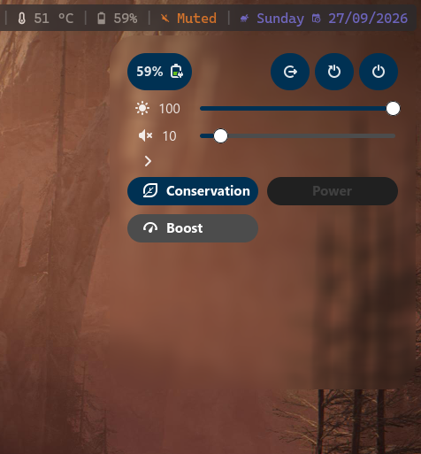

# Vinii's Graphical System Controller

A system quick settings menu

## Showcase

## Additional Requirements

<ul>
    <li>Systemd</li>
    <li>D-Bus</li>
    <li>PipeWire</li>
</ul>

## Extra

To properly use it I set up some extra external settings.

### Picom

<ul>
    <li>
        Set this opacity rule: <code>100:class_g = 'vgsc'</code>
    </li>
    <li>
        Set this corner radius rule: <code>30:class_g = 'vgsc'</code>
    </li>
</ul>

### i3wm

<ul>
    <li>
        Set this: <pre><code>
for_window [class="vgsc"]\
    floating enable,\
    border pixel 0,\
    move position 1568 40 
</code></pre>
    </li>
</ul>

### Polybar

<ul>
    <li>
        For custom modules I can just add <code>click-left = vgsc</code> (vgsc being in my $PATH)
    </li>
    <li>
        For builtin polybar modules I had to wrap its label in an action, for example: <code>label-charging = %{A1:vgsc:}%percentage%%%{A}</code>
    </li>
</ul>

